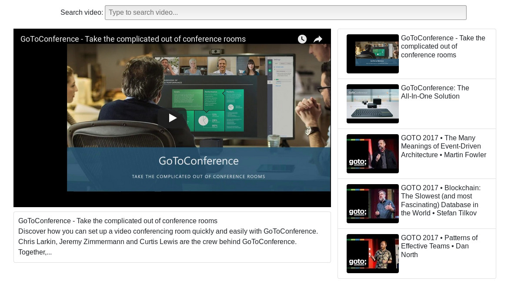

# Youtube video simple app



Simple application based on React and Google Youtube API

### Setup
Before go to 'www.cloud.google.com' then console.
Then add Youtube API and that set API_KEY to `src/index.js`
```js
// Key for Youtube v3 API, restricted by IP
const YT_API_KEY = 'someExampleKey';
```

Then install node modules and run node server
```bash
npm install
npm start
```
